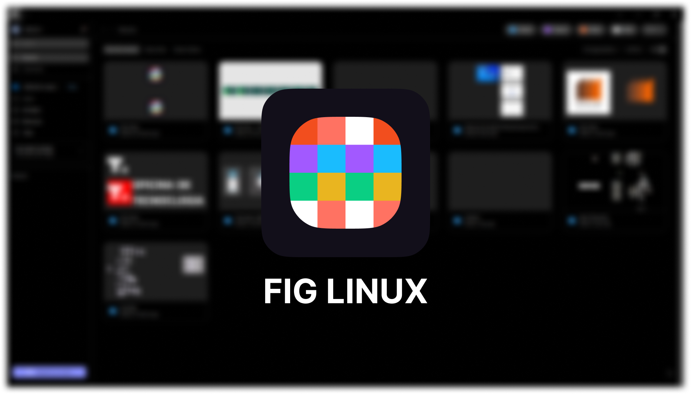

#  fig-linux

**English** | [Português (Brasil)](README.pt-BR.md)

fig-linux is an unofficial [Electron](https://www.electronjs.org)-based [Figma](https://figma.com) desktop app for Linux.

It is not affiliated with, endorsed or sponsored by Figma, Inc. "Figma" is a trademark of Figma, Inc.

<p align="center">
	
</p>

## Installation

Download the package for your distro from the
[latest release](https://github.com/carlosoliveiras/fig-linux/releases/latest)
(current version: **0.12.0**).

| Distro | File |
|---|---|
| Debian / Ubuntu | `fig-linux_<version>_linux_amd64.deb` |
| Fedora / openSUSE | `fig-linux_<version>_linux_x86_64.rpm` |
| Arch / Manjaro | `fig-linux_<version>_linux_x64.pacman` |
| Any distro | `fig-linux_<version>_linux_x86_64.AppImage` or `fig-linux_<version>_linux_x64.zip` |

### Debian-based distros

```bash
sudo apt install ./fig-linux_*_linux_amd64.deb
```

### RPM-based distros

```bash
sudo dnf install ./fig-linux_*_linux_x86_64.rpm
```

### Arch-based distros

```bash
sudo pacman -U fig-linux_*_linux_x64.pacman
```

### AppImage

```bash
chmod +x fig-linux_*.AppImage
sudo ./fig-linux_*.AppImage -i
```
This installs fig-linux on your system, after which you can run it from a terminal or from your app list.
Run `./fig-linux_*.AppImage -h` for more options.

### Coming from figma-linux

On the first run, fig-linux copies your settings, session and themes from
`~/.config/figma-linux` to `~/.config/fig-linux`. The old directory is left as is,
so you can remove it once everything works.

## Building from source

1. Clone the repository:
```bash
git clone https://github.com/carlosoliveiras/fig-linux
cd fig-linux
```
2. Install the dependencies:
```bash
npm i
```

Then:

- `npm run dev` to run the app in development mode
- `npm run build` to build the app for production
- `npm run start` to build and run it
- `npm run builder` to package the app. The targets are listed in `./config/builder.json`; remove the ones you don't need or don't have dependencies for.
- `npm run pack` to remove old packages from the installer directory, then build and package the app. The AppImage target needs [AppImageTool](https://appimage.github.io/appimagetool/).

Example of **.env** for local development:
```
NODE_ENV=dev
DEV_PANEL_PORT=3330
DEV_SETTINGS_PORT=3331
```

## Credits

fig-linux is based on [figma-linux](https://github.com/Figma-Linux/figma-linux)
by Chugunov Roman and contributors.

## License

GPL-2.0, see [LICENSE](LICENSE).
